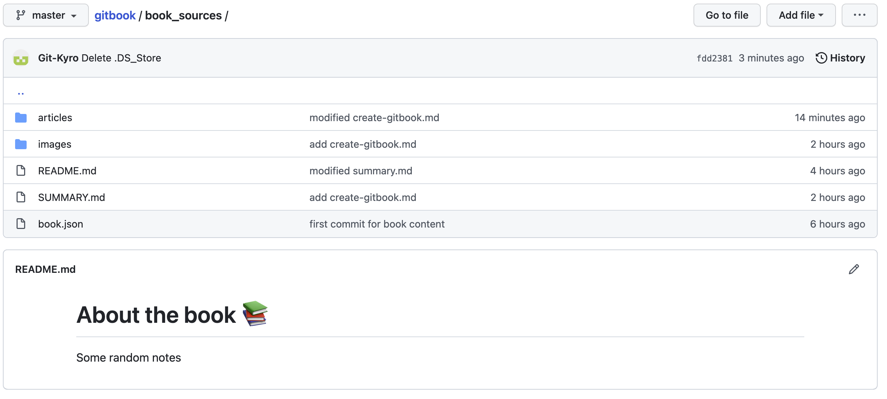
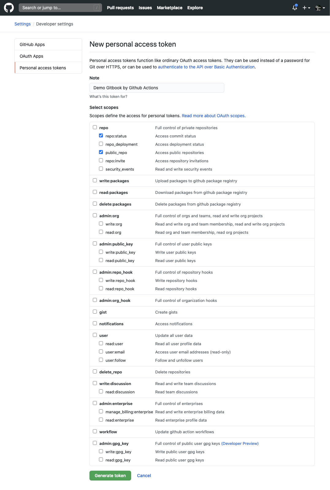
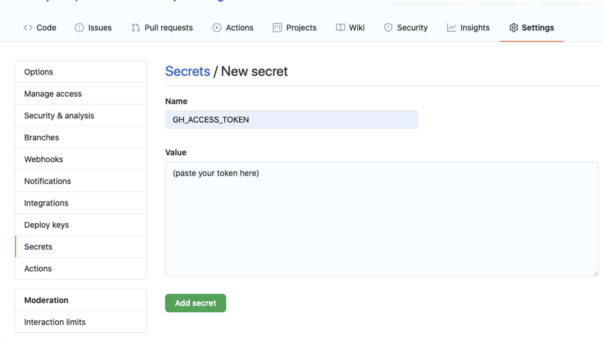
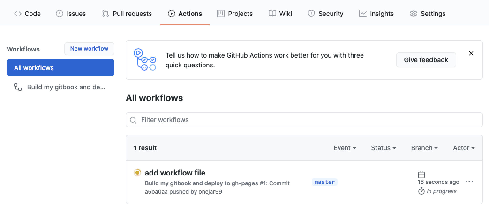
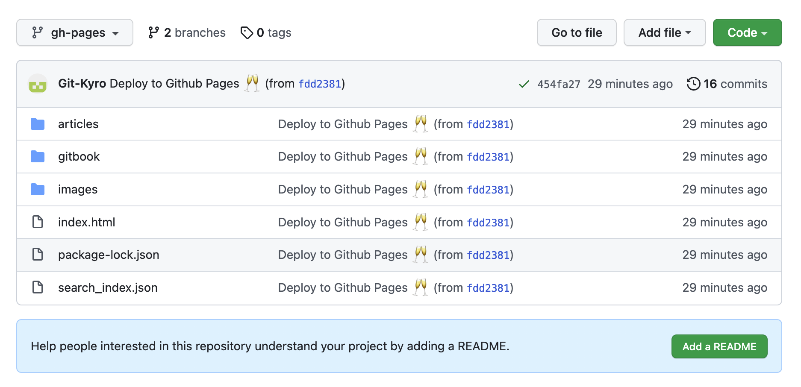
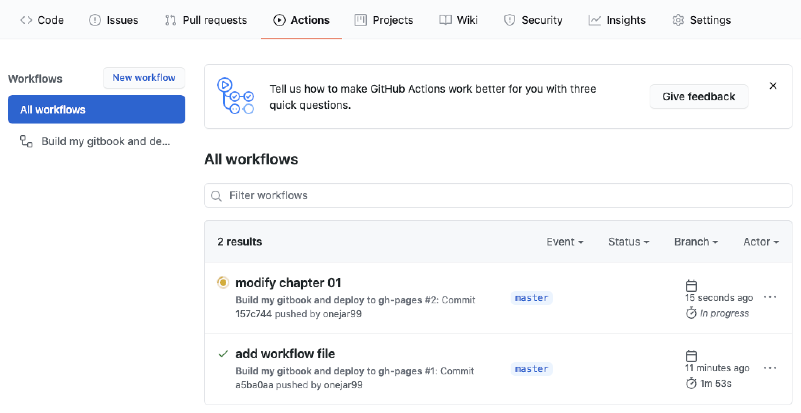

## 建立GitBook

利用 GiBook CLI + GitHub Pages + Github Actions 建立私人的GitBook，[参考链接](https://www.onejar99.com/gitbook-building-and-publishing-free-unlimitedly/)

### GitBook CLI 新建电子书

安装 gitbook-cli 脚手架工具

```sh
npm install gitbook-cli
```

初始化 gitbook 项目

```sh
gitbook init
```

初始化完成后会自动生成 README.md 和 SUMMARY.md

构建 gitbook 静态文件

```sh
gitbook build
```

构建完成后会自动生成 \_book/ 目录, 静态网站使用

在 GitHub 上新建一个名为 gitbook 的仓库，并克隆到本地，拷贝 gitbook 生成的文件到仓库,以下为目录结构的建议：

```sh
$ tree gitbook/
gitbook/
└── book_sources
    ├── README.md
    ├── SUMMARY.md
    ├── _book/
    ├── images 
    └── articles
        ├── chapter-01.md
        └── chapter-02.md
```
PS:

    把 GitBook 相關的檔案全部放在 book_sources 底下。
    
    README.md 是必要檔案，會成為 Introduction 頁面。
    
    SUMMARY.md 是必要檔案，會成為左邊的目錄。
    
    建議設一個資料夾 articles 專門放置文章檔，可以讓檔案結構更好維護。
    
    images 目录专门存放文档图片。

新增 book.json 文件，book.json 是 gitbook CLI 工具必要的文件

```sh
$ cat book_sources/book.json
{
    "plugins": [  "anchor-navigation-ex", "edit-link", "copy-code-button", "theme-comscore", "ga" ],
    "pluginsConfig": {
      "fontSettings": {
        "theme": "night",
        "family": "sans"
      },
      "theme-default": {
        "showLevel": false
      },
      "anchor-navigation-ex": {
          "showLevel": false,
          "associatedWithSummary": false,
          "printLog": false,
          "multipleH1": false,
          "mode": "float",
          "showGoTop":true,
          "float": {
              "floatIcon": "fa fa-navicon",
              "showLevelIcon": false,
              "level1Icon": "fa fa-hand-o-right",
              "level2Icon": "fa fa-hand-o-right",
              "level3Icon": "fa fa-hand-o-right"
          },
          "pageTop": {
              "showLevelIcon": false,
              "level1Icon": "fa fa-hand-o-right",
              "level2Icon": "fa fa-hand-o-right",
              "level3Icon": "fa fa-hand-o-right"
          }
      },
      "edit-link": {
        "base": "https://github.com/<你的 GitHub 帳號>/gitbook/edit/master/",
        "label": "Edit This Page"
      },
      "ga": {
        "token": ""
      }
    }
}
```

ps:

    anchor-navigation-ex：支援 TOC 和「回到頂端」的功能。這個 Plugin 我覺得非常出色，有興趣客製化設定可以參考作者的教學文件。

    copy-code-button：每個 Code Block 右上角會多一個 Copy 按鈕方便複製。

    edit-link：頁面頂端會多一個「EDIT THIS PAGE」的連結，點下去會開啟 GitHub 的編輯頁面。連結的字眼可以自訂。

    ga：Google Analytics，可以填入自己的 trace code

### 将所有文件 push 到 GitHub

```sh
$ echo -e "_book\nnode_modules" > .gitignore

# 將檔案推上 GitHub
$ git add .
$ git commit -m "first commit for book content"
$ git remote add origin git@github.com:<你的 GitHub 帳號>/gitbook.git
$ git push -u origin master
```



### 设置 GitHub Access Token

為了讓 GitHub Actions 能自動幫我們發佈 GitBook 成果到 GitHub Pages，必須授權 GitHub 操作我們的 Repository。作法就是設定 Access Token。

這裡都是在 GitHub 網頁上操作，按照以下步驟即可：

產生一個 GitHub Personal Access Token：

1. 點右上角帳號的頭像 -> 選擇 Settings -> 左邊列表選擇最底下的 Developer settings -> 下個頁面的左邊列表選擇Personal access tokens。
2. 點擊 Generate new token 按鈕。
3. 輸入 Token 的描述，權限勾選 repo:status 和 public_repo 兩個項目。
4. 點最下面的 Generate token 按鈕。
5. 這時候頁面上會顯示一組 Token，複製下來。



到 Repository 將剛剛的 Token 設定成 Secret：

1. 到想要自動發佈的 Repository -> 選擇 Settings -> 左邊列表選則 Secrets -> 點 New secret 按鈕。
2. 「Name」欄位填 GH_ACCESS_TOKEN，「Value」欄位貼上剛剛複製的 Token。
3. 點 Add secret 按鈕，設定就完成了。



### 添加 GitHub Actions Workglow

回到目录中，新增 build.yaml 文件

```sh
$ mkdir -p .github/workflows
$ vim .github/workflows/build.yml
```

只需要把 USER_NAME 和 USER_EMAIL 更换 GIT USER NAME 和 EMAIL:
```yaml
name: Build my gitbook and deploy to gh-pages

on:
  workflow_dispatch:
  push:
    branches:
      - master

jobs:
  build-and-deploy:
    name: Build and deploy
    runs-on: ubuntu-latest
    env:
      MY_SECRET   : ${{secrets.GH_ACCESS_TOKEN}}
      USER_NAME   : <your_user_name>
      USER_EMAIL  : <your_email>
      BOOK_DIR    : book_sources

    steps:
    - name: Checkout 🛎️
      uses: actions/checkout@v2.3.1
    - name: Build and Deploy 🚀
      uses: onejar99/gitbook-build-publish-action@v1.0.2
```

上面是一個 GitHub Actions 的設定檔，稱為一個「workflow」。
裡面用到官方的 checkout action，這幾乎是每個 workflow 的起手式。
另外用到我自己寫的一個 gitbook action，負責將 markdown 檔製成 GitBook 靜態網站，
並自動將網站檔案 commit 到 gh-pages branch.

### 将 Workflow push 到 GitHub， 触发自动发布到 GitHub Pages
```sh
$ git add .github/workflows/build.yml
$ git commit -m "add workflow file"
$ git push
```

回到 GitHub Repository 页面， 点[Actions], 会看到有一个 workflow 任务被自动触发执行中。



等执行完成后，会看到自动建立了 gh-pages branch 并 commit GitBook 静态网站



访问 GitBook：[https://<你的 GitHub 帳號>.github.io/gitbook](https://git-kyro.github.io/gitbook)。

### 编辑书籍内容， 测试 GitBook 自动发布更新

```sh
$ vim book_sources/articles/chapter-01.md
$ git add -u .
$ git commit -m "modify chapter 01"
$ git push
```

