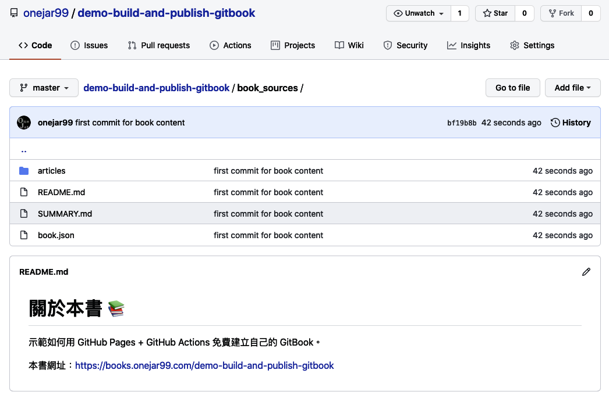

## 建立GitBook

利用 GiBook CLI + GitHub Pages + Github Actions 建立私人的GitBook

### GitBook CLI 新建电子书

安装 gitbook-cli 脚手架工具

```sh
npm install gitbook-cli
```

初始化 gitbook 项目

```sh
gitbook init
```

初始化完成后会自动生成 README.md 和 SUMMARY.md

构建 gitbook 静态文件

```sh
gitbook build
```

构建完成后会自动生成 \_book/ 目录, 静态网站使用

在 GitHub 上新建一个名为 gitbook 的仓库，并克隆到本地，拷贝 gitbook 生成的文件到仓库,以下为目录结构的建议：

```sh
$ tree gitbook/
gitbook/
└── book_sources
    ├── README.md
    ├── SUMMARY.md
    ├── _book/
    └── articles
        ├── chapter-01.md
        └── chapter-02.md
```
PS:

    把 GitBook 相關的檔案全部放在 book_sources 底下。
    
    README.md 是必要檔案，會成為 Introduction 頁面。
    
    SUMMARY.md 是必要檔案，會成為左邊的目錄。
    
    非必要，但建議設一個資料夾 articles 專門放置文章檔，可以讓檔案結構更好維護。

新增 book.json 文件

###### book.json 是 gitbook CLI 工具必要的文件，新增在 book_sources 文件夹下

```sh
$ cat book_sources/book.json
{
    "plugins": [  "anchor-navigation-ex", "edit-link", "copy-code-button", "theme-comscore", "ga" ],
    "pluginsConfig": {
      "fontSettings": {
        "theme": "night",
        "family": "sans"
      },
      "theme-default": {
        "showLevel": false
      },
      "anchor-navigation-ex": {
          "showLevel": false,
          "associatedWithSummary": false,
          "printLog": false,
          "multipleH1": false,
          "mode": "float",
          "showGoTop":true,
          "float": {
              "floatIcon": "fa fa-navicon",
              "showLevelIcon": false,
              "level1Icon": "fa fa-hand-o-right",
              "level2Icon": "fa fa-hand-o-right",
              "level3Icon": "fa fa-hand-o-right"
          },
          "pageTop": {
              "showLevelIcon": false,
              "level1Icon": "fa fa-hand-o-right",
              "level2Icon": "fa fa-hand-o-right",
              "level3Icon": "fa fa-hand-o-right"
          }
      },
      "edit-link": {
        "base": "https://github.com/<你的 GitHub 帳號>/gitbook/edit/master/",
        "label": "Edit This Page"
      },
      "ga": {
        "token": ""
      }
    }
}
```

ps:

    anchor-navigation-ex：支援 TOC 和「回到頂端」的功能。這個 Plugin 我覺得非常出色，有興趣客製化設定可以參考作者的教學文件。

    copy-code-button：每個 Code Block 右上角會多一個 Copy 按鈕方便複製。

    edit-link：頁面頂端會多一個「EDIT THIS PAGE」的連結，點下去會開啟 GitHub 的編輯頁面。連結的字眼可以自訂。

    ga：Google Analytics，可以填入自己的 trace code

### 将所有文件 push 到 GitHub

```sh
$ echo -e "_book\nnode_modules" > .gitignore

# 將檔案推上 GitHub
$ git add .
$ git commit -m "first commit for book content"
$ git remote add origin git@github.com:<你的 GitHub 帳號>/gitbook.git
$ git push -u origin master
```

