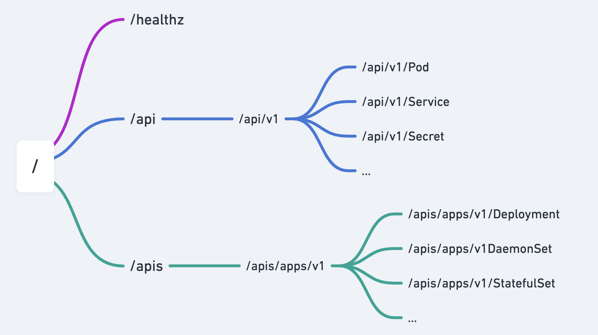

## K8S API



API 对象由：Group（API 组）、Version（API 版本）和 Resource（API 资源类型）三个部分组成的

```sh
/apis/${Group}/${Version}/namespace/${Namespace}/${Resource}/minio
```

```sh
kubectl get --raw /apis/apps/v1/namespaces/default/deployments/minio

Group: apps
Version: v1
Resource: deployments
```

查看指定API

```sh
kubectl get --raw /
kubectl get --raw /apis/apps/v1 | python -m json.tool
kubectl get --raw /api/v1 | python -m json.tool 
```

GVR 和 GVK 区别

Resouece: HTTP Restful API 请求路径中的资源

```sh
/apis/apps/v1/namespaces/default/deployments/minio

Group: apps
Version: v1
Resource: deployments
```

Kind: 系统中真正的实体

```sh
apiVersion: batch/v1
kind: Job
metadata:
  name: demo
  namespace: default

Group: batch
Version: v1
Kind: Job
```