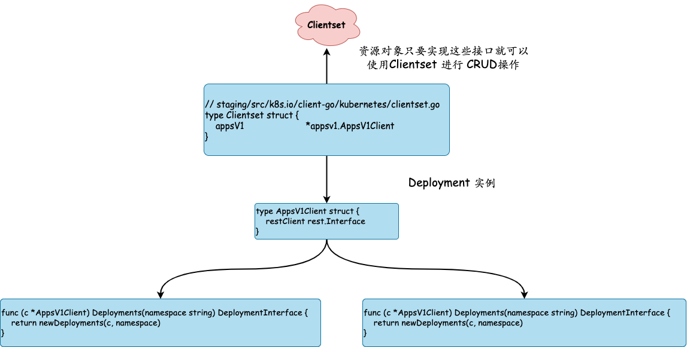

## K8S clientset

```go
package main

import (
    "flag"
    "fmt"
    "os"
    "path/filepath"

    metav1 "k8s.io/apimachinery/pkg/apis/meta/v1"
    "k8s.io/client-go/kubernetes"
    "k8s.io/client-go/rest"
    "k8s.io/client-go/tools/clientcmd"
)

func main() {
    var err error
    var config *rest.Config
    var kubeconfig *string

    if home := homeDir(); home != "" {
        kubeconfig = flag.String("kubeconfig", filepath.Join(home, ".kube", "config"), "(optional) absolute path to the kubeconfig file")
    } else {
        kubeconfig = flag.String("kubeconfig", "", "absolute path to the kubeconfig file")
    }
    flag.Parse()

    // 使用 ServiceAccount 创建集群配置（InCluster模式）
    if config, err = rest.InClusterConfig(); err != nil {
        // 使用 KubeConfig 文件创建集群配置
        if config, err = clientcmd.BuildConfigFromFlags("", *kubeconfig); err != nil {
            panic(err.Error())
        }
    }

    // 创建 clientset
    clientset, err := kubernetes.NewForConfig(config)
    if err != nil {
        panic(err.Error())
    }

    // 使用 clientsent 获取 Deployments
    deployments, err := clientset.AppsV1().Deployments("default").List(metav1.ListOptions{})
    if err != nil {
        panic(err)
    }
    for idx, deploy := range deployments.Items {
        fmt.Printf("%d -> %s\n", idx+1, deploy.Name)
    }

}

func homeDir() string {
    if h := os.Getenv("HOME"); h != "" {
        return h
    }
    return os.Getenv("USERPROFILE") // windows
}
```

通过 client-go 提供的 Clientset 对象获取资源数据

1. 使用 kubeconfig 文件或者 ServiceAccount（InCluster 模式）来创建访问 Kubernetes API 的 Restful 配置参数，也就是代码中的 rest.Config 对象

2. 使用 rest.Config 参数创建 Clientset 对象，这一步非常简单，直接调用kubernetes.NewForConfig(config)即可初始化

3. 然后是 Clientset 对象的方法去获取各个 Group 下面的对应资源对象进行 CRUD 操作



