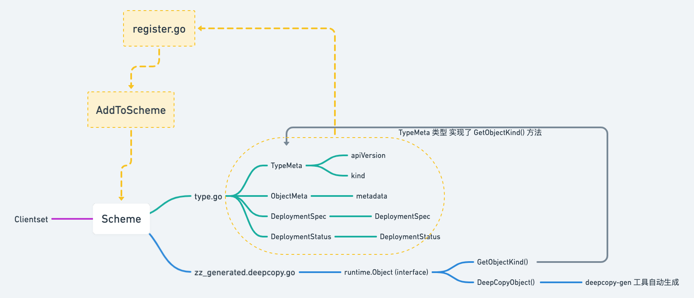

## K8S scheme



Client-go 操作 K8S 资源对象需要通过 Scheme

```sh
staging/src/k8s.io/api/apps/v1
├── BUILD
├── doc.go
├── generated.pb.go
├── generated.proto
├── register.go
├── types.go
├── types_swagger_doc_generated.go
└── zz_generated.deepcopy.go
```

apiVersion 与 kind 就是 TypeMeta 属性，metadata 属性就是 ObjectMeta，spec 属性就是 DeploymentSpec，

当资源部署过后也会包含一个 status 的属性，也就是 DeploymentStatus

把资源对象注册到 Scheme 需要实现 Object 接口，所有注册到 Scheme 的资源类型都要实现 runtime.Object 接口：

```go
// staging/src/k8s.io/apimachinery/pkg/runtime/interface.go

type Object interface {
	GetObjectKind() schema.ObjectKind
	DeepCopyObject() Object
}
```

zz_generated.deepcopy.go 文件是由 deepcopy-gen 工具创建的定义各资源类型 DeepCopyObject() 方法的文件，

```go
// +k8s:deepcopy-gen:interfaces=k8s.io/apimachinery/pkg/runtime.Object

// Deployment enables declarative updates for Pods and ReplicaSets.
type Deployment struct {
......
}
```

所有资源对象都实现了TypeMeta

```go
// staging/src/k8s.io/apimachinery/pkg/apis/meta/v1/meta.go

func (obj *TypeMeta) GetObjectKind() schema.ObjectKind { return obj }
```

register.go 文件的主要作用是定义 AddToScheme 函数，将各种资源类型注册到 Clientset 使用的  Scheme 对象中去，

由于每个资源自动生成了 DeepCopyObject() 方法，这样资源就实现了 runtime.Object 接口，所以可以注册到 Scheme 中去了。

```go
// staging/src/k8s.io/api/apps/v1/register.go

var (
	// TODO: move SchemeBuilder with zz_generated.deepcopy.go to k8s.io/api.
	// localSchemeBuilder and AddToScheme will stay in k8s.io/kubernetes.
	SchemeBuilder      = runtime.NewSchemeBuilder(addKnownTypes)
	localSchemeBuilder = &SchemeBuilder
	// 对外暴露的 AddToScheme 方法用于注册该 Group/Verion 下的所有资源类型
	AddToScheme        = localSchemeBuilder.AddToScheme
)
```

```go
// staging/src/k8s.io/client-go/kubernetes/scheme/register.go

// 新建一个 Scheme，将各类资源对象都添加到该 Scheme
var Scheme = runtime.NewScheme()  
// 为 Scheme 中的所有类型创建一个编解码工厂
var Codecs = serializer.NewCodecFactory(Scheme)
// 为 Scheme 中的所有类型创建一个参数编解码工厂
var ParameterCodec = runtime.NewParameterCodec(Scheme)
// 将各 k8s.io/api/<Group>/<Version> 目录下资源类型的 AddToScheme() 方法注册到 SchemeBuilder 中
var localSchemeBuilder = runtime.SchemeBuilder{
	......
	appsv1.AddToScheme, 
	appsv1beta1.AddToScheme,
	appsv1beta2.AddToScheme,
	......
}

var AddToScheme = localSchemeBuilder.AddToScheme

func init() {
	v1.AddToGroupVersion(Scheme, schema.GroupVersion{Version: "v1"})
	// 调用 SchemeBuilder 中各资源对象的 AddToScheme() 方法，将它们注册到到 Scheme 对象
	utilruntime.Must(AddToScheme(Scheme))
}
```
